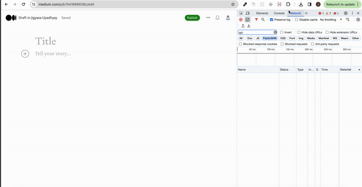

# cherry-gpt
Cherry - AI chrome assistant powered by chatGPT

Cherry is your personal AI based chrome extension that will assist you while typing in the current active tab.

just prefix your prompt with "cherry:" and suffix it with ";"

for ex :

cherry: write a short essay for me;
cherry: write a short blog on engineering ;

demo screenshots 

# demo 1

# demo 2 

